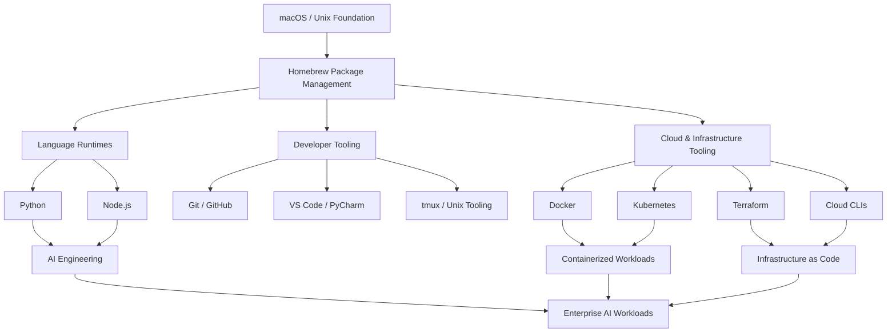

# Enterprise AI Workstation

### A Reproducible Engineering Environment for AI, Cloud, DevOps & Software Engineering

Modern AI systems don't begin with a model.

They begin with the engineering environment underneath it.

**Enterprise AI Workstation** is my reproducible development foundation for building, testing, deploying, and operating AI and cloud-native systems across multiple technology stacks.

> **A workstation is infrastructure. Treat it like infrastructure.**

---

## Why I Built It

Engineering environments have a tendency to grow organically.

Install Python.

Add Docker.

Add a cloud CLI.

Install Terraform.

Add another runtime.

Six months later, the workstation works—but nobody can explain exactly why.

That creates the same problems we try to eliminate in production:

- configuration drift
- inconsistent dependencies
- undocumented tooling
- difficult recovery
- poor reproducibility
- environment-specific failures

I wanted the opposite.

A deliberate engineering environment where each layer has a purpose and the workstation itself can evolve alongside the systems being built on it.

---

## Architecture



The workstation is organized as a set of engineering layers rather than a collection of unrelated installations.

Each layer supports the one above it.

---

## 1. Unix Foundation

The workstation is built on macOS, providing a Unix-based development environment and access to the command-line tools and conventions that underpin much of modern software infrastructure.

This creates a familiar foundation for working across:

- Linux environments
- cloud infrastructure
- containers
- remote systems
- Git workflows
- automation
- developer tooling

The goal is not simply command-line proficiency.

It is understanding the operating environment beneath the application.

---

## 2. Package Management

Homebrew provides a consistent mechanism for installing and maintaining much of the workstation's engineering toolchain.

Centralized package management reduces ad hoc installation and makes upgrades, dependency management, and environment maintenance more deliberate.

```bash
brew update
brew upgrade
brew list
```

The principle is simple:

> **Know what is installed, know how it got there, and know how to reproduce it.**

---

## 3. Language Runtimes

### Python

Python provides the primary runtime for AI engineering, automation, data workloads, APIs, and agentic systems.

The environment supports modern Python dependency and project-management workflows rather than relying on a single global environment.

### Node.js

Node.js provides the JavaScript runtime required by modern development tooling, SDKs, automation platforms, and application frameworks.

Maintaining both runtimes allows the workstation to support heterogeneous engineering environments rather than assuming every workload belongs to one language ecosystem.

---

## 4. Containers & Orchestration

### Docker

Containers provide isolation between applications and their dependencies while creating a consistent execution environment across development and deployment targets.

### Kubernetes

Kubernetes extends that model into orchestration—providing the foundation for managing containerized workloads across distributed infrastructure.

Together:

```text
Application
     ↓
Container
     ↓
Orchestration
     ↓
Infrastructure
```

This creates a progression from local development to production-oriented distributed systems.

---

## 5. Infrastructure as Code

Terraform provides a declarative mechanism for defining infrastructure as code.

Rather than treating infrastructure configuration as a sequence of manual console operations, infrastructure can be:

- version controlled
- reviewed
- reproduced
- tested
- changed deliberately

The same engineering discipline applied to application code should apply to infrastructure.

---

## 6. Multi-Cloud Engineering

The workstation is designed to support engineering across major cloud environments rather than tying development practices to a single provider.

Cloud tooling can support work across:

**AWS** — infrastructure, compute, networking, AI/ML, and cloud-native services

**Google Cloud** — data, AI/ML, infrastructure, and platform engineering

**Microsoft Azure** — enterprise infrastructure, identity, AI, and application platforms

The objective is not collecting cloud tools.

It is maintaining a consistent engineering workflow while the deployment target changes.

---

## 7. AI Engineering

AI development sits on top of the engineering foundation rather than replacing it.

The environment supports work involving:

- LLM APIs and SDKs
- agentic systems
- RAG architectures
- vector databases
- embeddings
- MCP
- model evaluation
- automation
- containerized AI services
- cloud AI platforms

This distinction matters.

> **AI engineering is still engineering.**

Models may change rapidly.

The need for reliable environments, networking, security, observability, testing, deployment, and infrastructure does not.

---

## 8. Verification

A workstation isn't reproducible merely because software was installed successfully.

The environment should be verifiable.

Examples include:

```bash
python --version
node --version
npm --version
git --version
docker --version
kubectl version --client
terraform version
```

Cloud tooling can be verified independently as each provider is configured.

The objective is a simple one:

**Installed does not necessarily mean operational. Verify the environment.**

---

## Engineering Principles

### Reproducibility Over Convenience

A working machine is useful.

A working machine whose configuration can be understood and recreated is engineering.

### Layers Over Tool Collections

Tools are organized according to the capability they provide rather than accumulated as unrelated installations.

### Verify Before Building

A broken dependency discovered during deployment is considerably more expensive than one discovered during workstation validation.

### Use the Right Abstraction

Not every problem requires custom code.

Package managers, containers, infrastructure as code, automation platforms, and managed services exist because abstraction can reduce unnecessary operational complexity.

### Understand the Layer Beneath You

Application behavior is influenced by the operating system, runtime, network, container, infrastructure, and cloud environment beneath it.

Strong engineering requires being able to move down those layers when something fails.

---

## Technology Stack

| Layer | Technologies |
|---|---|
| Operating Environment | macOS / Unix |
| Package Management | Homebrew |
| Languages | Python, Node.js |
| Source Control | Git, GitHub |
| Containers | Docker |
| Orchestration | Kubernetes |
| Infrastructure as Code | Terraform |
| Cloud | AWS, Google Cloud, Microsoft Azure |
| Development | VS Code, PyCharm |
| Terminal Workflow | Unix CLI, tmux |
| AI Engineering | OpenAI SDK, RAG, Agents, MCP, Vector Systems |

---

## What I Learned

The most useful lesson wasn't how to install another engineering tool.

It was recognizing that the development environment itself is part of system architecture.

Every production system eventually depends on layers beneath the application:

> runtime  
> operating system  
> containers  
> networking  
> infrastructure  
> cloud services

Understanding those layers makes it easier to diagnose failures, evaluate architectural trade-offs, and build systems that can move beyond a developer's laptop.

The workstation, therefore, isn't the destination.

**It's the engineering foundation for everything built next.**

---

## Status

**Active engineering environment**

This workstation continues to evolve as new projects introduce legitimate engineering requirements.

New tooling is added when a system requires it—not simply because a technology exists.
